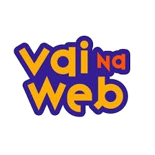

<p align="center">
  
</p>
<h1 align="center">Site Padrinhos Mágicos</h1>

## 🔥 Introdução
Site desenvolvido para aplicar as boas práticas de codificação e estruturação do projeto utilizando HTML e SASS.

## 🔨 Guia de instalação
1. Clone o repositório usando o `Git`
```bash
  git clone https://github.com/tatyanepgoncalves/website-padrinhos-magicos.git
```

2. Abra o arquivo
```bash 
  cd desafio-2
  code .
```

3. Inicie o servidor de desenvolvimento
No arquivo `index.html` procure `live server` na barra inferior da IDE ou clique do botão direto do mouse e clique em `Open with Live Server`

> A extensão Live Server deve ser baixada para que consiga inicializar o servidor de desenvolvimento.

## 📦 Tecnologias usadas:
- HTML5
- SASS

## 👷 Autores
- **Tatyane Gonçalves** - *Desenvolvedora* - [@tatyanepgoncalves](https://github.com/tatyanepgoncalves)
- **Equipe Vai na Web** - *Criador e educador técnico* - [@vainaweb](https://www.instagram.com/vainaweb/)